<h1 align="center">Przemysław Kłys</h1>

  <strong>IT Architect · Open-source maintainer · Microsoft MVP</strong> 
  PowerShell · .NET · Identity · Microsoft 365 · Documents · Enterprise automation

  
  
  
  

  
  
  
  

  

I am an IT architect, open-source maintainer, and [Microsoft MVP](https://mvp.microsoft.com/en-us/PublicProfile/5003657?fullName=Przemys%C5%82aw%20K%C5%82ys) since 2020. I build PowerShell and .NET tools for identity, Microsoft 365, reporting, document automation, and the less glamorous parts of enterprise IT that still need to work every day.

Most of that work lives in the [EvotecIT organization](https://github.com/EvotecIT), so this personal account is intentionally quieter than the engineering behind it. I use the best tool for the job; PowerShell simply wins that argument suspiciously often.

### What I build

- **Identity and Windows infrastructure:** Active Directory health, Group Policy analysis, security reporting, cleanup, and operational automation.
- **Documents and reporting:** Word, Excel, PowerPoint, PDF, email, and HTML generation without Office automation or browser-era glue.
- **Reusable engineering foundations:** rendering, packaging, data access, diagnostics, and shared components that keep product surfaces thin.

### Good places to start

- [OfficeIMO](https://github.com/EvotecIT/OfficeIMO) — COM-free .NET document libraries covering Office, PDF, email, OneNote, and text formats.
- [PSWriteHTML](https://github.com/EvotecIT/PSWriteHTML) — rich HTML reports, dashboards, charts, and email from PowerShell.
- [GPOZaurr](https://github.com/EvotecIT/GPOZaurr) — Group Policy inventory, analysis, cleanup, and remediation.
- [Testimo](https://github.com/EvotecIT/Testimo) — practical Active Directory health checks and infrastructure validation.
- [PowerBGInfo](https://github.com/EvotecIT/PowerBGInfo) — a flexible PowerShell and .NET alternative to BGInfo.

### Support the work

If a project I maintain saves you time, [GitHub Sponsors](https://github.com/sponsors/PrzemyslawKlys) helps fund the infrastructure, tooling, and focused engineering time behind future releases.

### Recent writing from Evotec

<!-- BLOG-POST-LIST:START -->
- [Power Apps - How to Work Around the appres://blobmanager issue](https://evotec.xyz/blog/powerapps-work-around-the-appres-blobmanager-issue/)
- [How to contribute a post to evotec.xyz](https://evotec.xyz/blog/how-to-contribute-to-evotec-blog/)
- [Supercharging Your Network Diagnostics with Globalping for NET](https://evotec.xyz/blog/supercharging-your-network-diagnostics-with-globalping-for-net/)
- [Automating Network Diagnostics with Globalping PowerShell Module](https://evotec.xyz/blog/automating-network-diagnostics-with-globalping-powershell-module/)
- [Enhanced Dashboards with PSWriteHTML – Introducing InfoCards and Density Options](https://evotec.xyz/blog/enhanced-dashboards-with-pswritehtml-introducing-infocards-and-density-options/)
- [Mastering Active Directory Hygiene: Automating SIDHistory Cleanup with CleanupMonster](https://evotec.xyz/blog/mastering-active-directory-hygiene-automating-sidhistory-cleanup-with-cleanupmonster/)
<!-- BLOG-POST-LIST:END -->
